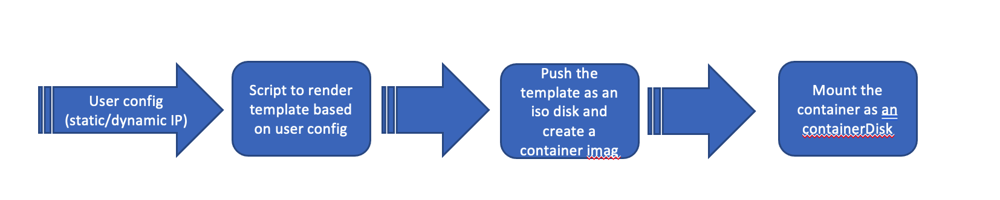

# Steps

Follow the link [here](https://ard92.github.io/2022/06/06/bootstrap_configs_for_vsrx_on_kvm.html)

## Rendering templates
Since the bootstrap method needs the whole config present in the container disk. The below script can be used to render the template based on user defined IP addres for fxp0 interface and create the container image.
The container image would then be referred in the kubevirt manifest file. 



```
(jinja) root@k8s-master:/home/aprabh/kubevirt-manifests/vsrx_bootstrap_example# python render_template.py --help
usage: render_template.py [-h] [-cname CNAME] [-reg REG] [-fxp FXP]

optional arguments:
  -h, --help    show this help message and exit
  -cname CNAME  optional param. save the image as .tar file which can be used to copy to other nodes
  -reg REG      registry name. container would be built with tag in format <user>/<regname>:<tag>
  -fxp FXP      fxp address in format w.x.y.z/subnet which needs to be part of day0 config
```

### Usage 
```
python3 render_template.py -fxp 192.167.1.1/24 -reg aprabh/vsrx:config -cname vsrxconfig
```
Running the above, will create a dir iso_dir with the rendered template. Once the template is rendered, it would create a container.
This container image has to be reffered into the kubevirt manifest file as 

```
< ---- snipped ---- >
      volumes:
        - name: boot
          dataVolume:
            name: vsrx-sriov
        - name: config
          containerDisk:
            image: aprabh/vsrx:config
            path: /configpath/config.iso
```

